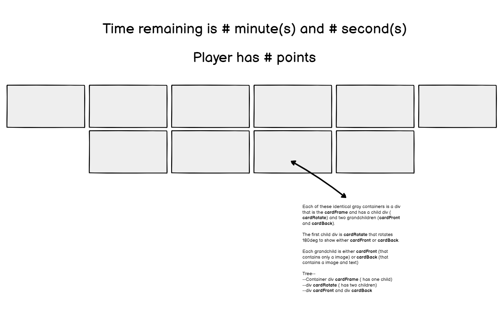
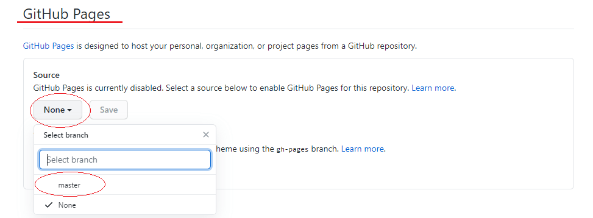
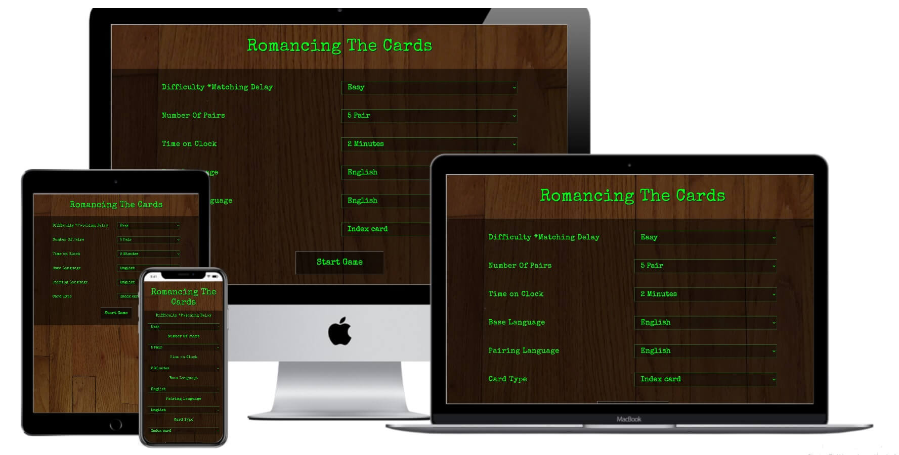
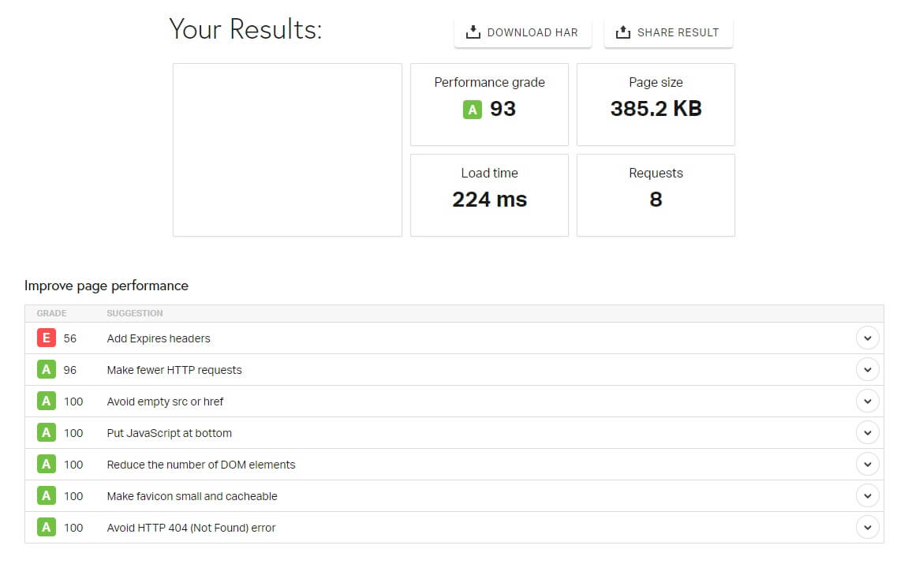

# omancing The Cards

The purpose of this webpage is to illustrate how a simple game can help with learning/memorizing words in a different language. It also has the added bonus of helping repeated
users improve their memory retention ability. This games premise is the flash card strategy students use to help learn new material. The user picks two languages before the
game starts and then must pair the same word in both languages. The game also adds a timer and point system to give users a goal and sense of urgency to complete the game.

# Wireframe and Live Demo
#### Wireframe 

+ Wireframes were made for all predetermined size variations of the webpage.
+ Each wireframe that contains cards was given a pointing arrow and a description because of the complexity of the card design.
+ [Click here to view all wireframes associated to this project.](assets/readme/wireframe "location of wireframes")

#### Live Demo

+ A fully functioning demo can be found on GitHub, [here](https://richardaeld.github.io/google_translate_game/ "deplayment location")
+ GitHub's IDE GitPod was used for the entire construction and planning process.
+ GitHub houses the master branch.

# Deployment information
+ Go to the location of the respository in GitHub (ex. https://github.com/Richardaeld/google_translate_game).
+ Select Settings (Circled in red in picture below).

+ Go down in settings page until you find the heading "GitHub Pages" (underlined in red in picture below).
+ Click "None" under the Source subheading (circled in red in picture below).
+ Select the branch you wish to publish.
+ In this example we chose to select master (circled in red in picture below).

+ Click save (underlined in red in picture below).

+ Reload page and you will see the layout under Github Pages will change and tell you the page is ready to be published.

+ Once the page has fully published the layout will change once more and tell you the site has published.

+ Now the page is fully viewable at the provided HTTP address.

# UX Choices 

### Game Start Screen
+ The game title stands out because of the use of a large font with a dark text shadow
+ The text descriptions/choices are placed over a dark background with a bright text color to help them stand out and draw the eye

### Game Board and Game Play
+ A dark picture background was used to help the cards stand out.
+ The background image of the game cards resembles that of flash cards that school students would use.
+ The font family chosen for the cards resembles hand writting and was paired with a bright text color to give the feeling of home made flash cards.
+ Selectable card backgrounds were added to give repeated users something different to look at. 

### Page Performance
+ Code kept simple, clean, and elegant for quicker loadtimes.
+ Loadtime checked by [Pingdom](https://tools.pingdom.com/).

+ All images have been compresssd by [tinyPNG](https://tinypng.com/).

# Brand Identity
This game should give the feeling of studying at home or in school for an exam and is accomplished though:
+ The use of a background that resembles a desk or dining room table.
+ The default cards are ment to resemble index cards that would be used like flash cards to help someone study.
+ The font used on the cards was ment to resemble hand writting to give the feeling of a hand made card.
+ A bright color was used to give users the feeling of personality from someone that might use a highlighter to make studying more fun.

# Client Stories and Experience Provided
## Client Stories
+ As a user, I'd like an enjoyable way to waste my free time.
+ As a user, I'd like a game that forces me to use my mental retaining ability.
+ As a user, I'd like to learn some basic words of a different language.

## Experience Provided
+ The game has adjustable difficulty, timer, and total card pairs for a enjoyable was to spend time.
+ The games adjustable difficulty can be used to provide an experience that will cause the user to lose if they only hunt and peck.
+ The game has several different languages to pick from to pair with their comparable English or othe language counterpart.

# Testing
## Checking Languages and Pairings
#### Expectation(s):
1. The game always has the correct pair of words up to match.

#### Assumption(s):
1. A basic understanding of foreign languages used or a cheat sheet of correct word pairs.
1. User will NOT reload browser between play throughs.

#### Testing Step(s):
1. Start the game on its default setting or add more time to timer if needed.
1. Complete the game.
1. Wait for game to restart.
1. Select the next amout of cards (10) and repeat steps 2 and 3.
1. Select the last level of cards (15) and repeat steps 2 and 3.
1. Select the next language, reset cards to start level (5), and start game.
1. Repeat steps 2, 3, 4, 5, and 6 until all languages have been cycled through.

#### Document Result(s):
1. Document any incidences of incorrect, game accepted word pairings.
1. document any incidences of cards left on the table when they should have disappeared.

--------------------------------

## Checking Menues, Lose/Win Conditions, Header items, and Multiple Round Playability
#### Expectation(s):
1. Menues disappear when not in use.
1. Game tells user when they have won or lost.
1. Header items are easily visible, disappear when not in use, always display correct values.

#### Assumption(s):
1. User will NOT reload browser between play throughs.
1. User knows game header consists of win/lost condition, game title, player points, and time remaining.

#### Testing Step(s):
1. Start a game with default settings. 
1. Let it run out, check for game header to change to lose condition and let game reset.
1. Select next level of time and start the game.
1. Let it run out, check for game header to change to lose condition and let game reset.
1. Repeat steps 3 and 4 until all times have been selected.
1. Start another game, win this round, and check game for win title.
1. Change card count and repeat step 6.
1. Change language and repeat step 6.
1. Change difficulty and repeat step 6. 

#### Document Result(s):
1. document any incidences of incorrect title presentation.
1. document any failure of timer to lose game.
1. document any multiple playthrough errors (mismatching cards, incorrect card placement, etc...).
------------------------------------------------------

## Previous and Current bugs
#### Previous Bug(s)
+ Occasionally a matching pair of cards will leave a single card on the table, sometimes making the game unwinnable.  This card can be either face up or face down. This bug was
generated by not flashing the "clickRecord" when a user lost the game.
+ Some words with masculine and feminine forms (ex. celles-ci/ceux-ci) excede the character limit of line space and drop to the line below. This was creating an unappealing 
visual appearance. This bug was fixed by a change to font-size unites from rem to a combination of rem and vw. However a pixel width roughly between 1200 and 1166 can still use two 
lines but now they retain a good visual experience.
+ A screen pixel width below 320 or above 4000 begin to quickly lose a good visual experience. 

## Scaleability
+ Add an api that would read out the 'pairing langauge' word of a matched card.
+ Add a greater selection of different card backgrounds to give the user a different visual experience according to their preference.
+ Add a game board background selector for a different visual experience for returning users.

# Tools, References, Code, and idea(s) used
## Tools
+ [Bootstrap](https://getbootstrap.com/) - Used as framework
+ [GitHub](https://github.com/) - Deployment of prototype website
+ [GitPod](https://www.gitpod.io/) - Integrated development environment
+ [Google Fonts](https://fonts.google.com/) - Used font families from here
+ [Jigsaw (Validation Service)](https://jigsaw.w3.org/css-validator/) - Used to identify errors in CSS
+ [Pingdom](https://tools.pingdom.com/) - Checked for page load time
+ [Techsini](https://techsini.com/multi-mockup/) - Used for their viewable responsiveness PNG
+ [TinyPNG](https://tinypng.com/) - Minimizing KB load per image
+ [W3C Validator](https://validator.w3.org/) - Used to identify errors in markup

## References and Code Used
+ [MDN web docs](https://developer.mozilla.org/en-US/docs/Web/JavaScript) - Invaluable source of information about JavaScript
    + Used a piece of code to allow background to travel entire length of page
    + Used code and idea to help with rotating the cards on the board
+ [Stack Overflow](https://stackoverflow.com/) - Helped with understands importance of loops in JavaScript
+ [TestLodge](https://blog.testlodge.com/how-to-write-test-cases-for-software-with-sample/) - Used for test case examples
+ [W3Schools](https://www.w3schools.com/) - A wonderful resource of element, attribute, and event selection
    + Used code and idea to help with rotating the cards on the board
+ [Bootstrap](https://getbootstrap.com/) - Framework used to help speed up development and add a better UX:
+ [github](https://docs.github.com/en/enterprise/2.14/user/articles/configuring-a-publishing-source-for-github-pages) - Using the style and 
structure of githubs deployment information as the basis of the readme's deployment section

## idea(s) used
+ [maxnyla's deployment section from her readme](https://github.com/maxnyla/Pawsome) - the idea was using githubs literal deployment process in the readme's deployment section 

# Technologies (langauges) used
+ HTML - Is the basic construction (foundation) of this webpage
+ CSS - Makes the basic construction of this webpage more visually appealing 
+ JavaScript - Allow users to interact with webpage without having to reload page or load multiple pages

# Acknowledgements
+ Felipe Souza Alarcon for his honest guidence, foresight, and providing stellar hints to questions I hadnt asked yet. 
+ Emily Grooms for help in revising this README document.